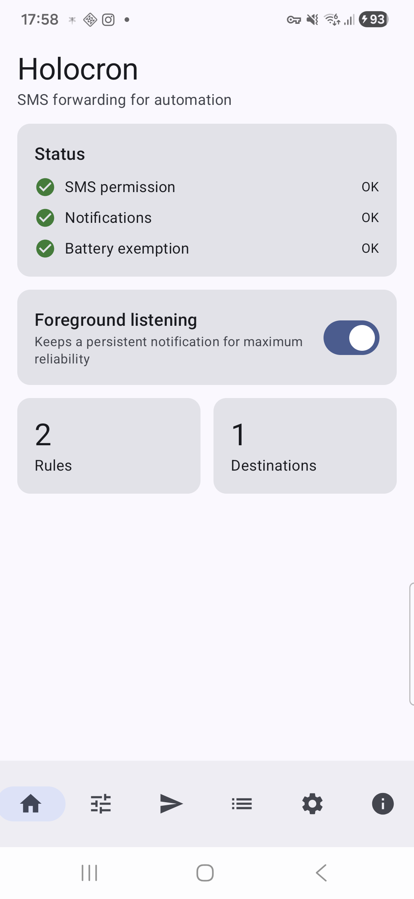
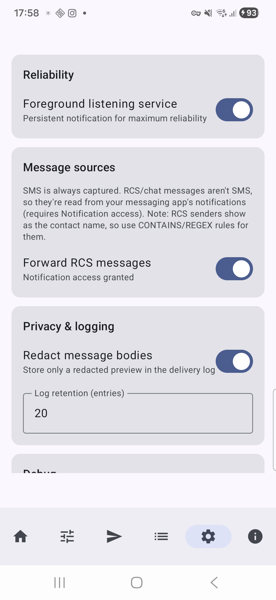
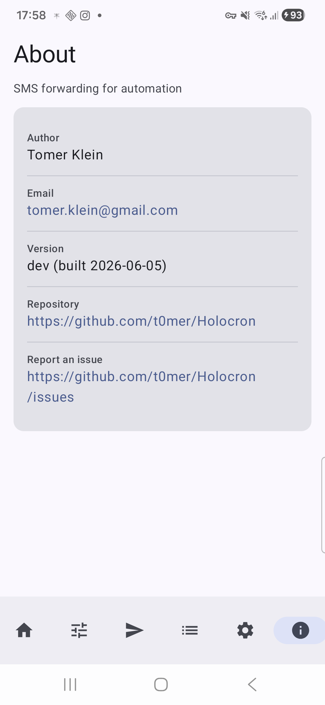
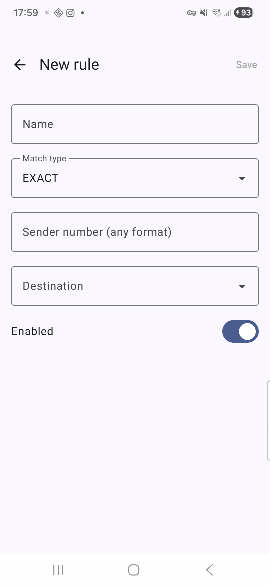
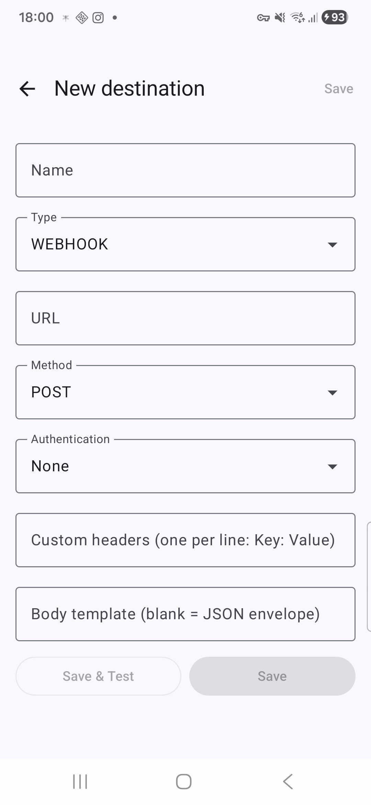

# Holocron

**SMS forwarding for automation.** Holocron is a sideloaded Android app that listens for
incoming **SMS** (and, optionally, **RCS** chat messages), matches them against simple
sender rules, and forwards the content to your own endpoints — an HTTP **webhook**, a generic
**REST API**, or an **MQTT** topic. It's built for a personal home lab: your phone, your
messages, your endpoints. No analytics, no third-party SDKs, nothing leaves the device except
to the destinations you configure.

> Typical uses: pipe bank/2FA/OTP alerts into Home Assistant or n8n, push delivery and alarm
> texts to MQTT, or kick off automations from messages sent by a specific number.

## Screenshots

| Home / Status | Settings | About |
|---|---|---|
|  |  |  |

| New rule | New destination |
|---|---|
|  |  |

## Features

- **SMS capture** via a manifest broadcast receiver — multipart messages are reassembled per
  sender. The app does **not** become the default SMS app and never requests `READ_SMS`/`SEND_SMS`.
- **RCS capture (opt-in)** via a `NotificationListenerService` that reads incoming messages
  from Google/Samsung Messages — RCS never arrives as SMS, so it's read from notifications.
- **Sender rules** with three match modes:
  - `EXACT` — phone numbers normalized to E.164 (so `+972…`, `0…`, and spaced forms all match).
  - `CONTAINS` / `REGEX` — operate on the raw sender, ideal for alphanumeric sender IDs and
    RCS contacts (which surface as a display name).
- **Destinations**:
  - **Webhook / REST API** (OkHttp) with selectable method, a body template, and custom headers.
  - **HTTP authentication**: None, Basic (user+password), Token (`Authorization: Bearer …`),
    or **Cloudflare service tokens** (`CF-Access-Client-Id` / `CF-Access-Client-Secret`).
  - **MQTT** (HiveMQ client): host/port, TLS, topic, QoS, retain, optional credentials, and
    raw-body or full-JSON payload.
- **Payload templating** — `{{sender}}`, `{{body}}`, `{{timestamp}}`, `{{ruleName}}`, or the
  default JSON envelope `{sender, body, timestamp, ruleName}`.
- **Reliable delivery** — every forward runs through WorkManager with a network constraint and
  exponential-backoff retry. A **delivery log** records each attempt, with expandable error
  detail and a **retry** action for failures.
- **Test button** — send a synthetic message to a destination to validate wiring without
  waiting for a real text.
- **Reliability options** — an optional persistent foreground service, a battery-optimization
  exemption prompt, and re-arming on reboot.
- **Backup** — export/import rules and destinations as JSON (idempotent re-import; secrets are
  never exported).

## How it works

```
Incoming SMS ─▶ BroadcastReceiver ─┐
                                   ├─▶ reassemble ─▶ match enabled rules by sender
Incoming RCS ─▶ NotificationListener ┘                       │
                                                             ▼
                                              enqueue a WorkManager job per match
                                                             │
                                                             ▼
                                  Webhook / API / MQTT dispatcher (retry + backoff)
                                                             │
                                                             ▼
                                                   record in the delivery log
```

A real SMS that also raises a messaging-app notification is **de-duplicated** so it forwards
only once.

## Permissions & privacy

- **`RECEIVE_SMS`** — intercept incoming SMS (runtime grant).
- **`POST_NOTIFICATIONS`** — the foreground-service notification (Android 13+).
- **Notification access** — only if you enable RCS forwarding (granted from system settings).
- **`RECEIVE_BOOT_COMPLETED`**, foreground-service, and battery-exemption — for always-on reliability.

Privacy posture:

- Credentials (MQTT, HTTP auth, custom headers) and the in-flight message body are stored
  **encrypted** (Android Keystore–backed `EncryptedSharedPreferences`) — never in plaintext
  database columns or WorkManager input.
- Message bodies are **never logged** in release builds unless you explicitly enable the
  **Debug logging** switch in Settings.
- The delivery log stores a redacted preview by default (toggleable).

## Getting started

1. Build and install (see below), or grab the APK from the latest release.
2. Open the app and grant **SMS** and **Notifications** permissions on the Home screen; accept
   the **battery-optimization** exemption for reliable background delivery.
3. Add a **Destination** (webhook/API/MQTT) and use **Save & Test** to verify it.
4. Add a **Rule** matching a sender and pointing at that destination.
5. (Optional) In **Settings → Message sources**, enable **Forward RCS messages** and grant
   notification access.

> **RCS note:** RCS senders appear as the contact's **display name** (numbers when available),
> not always a phone number — use `CONTAINS`/`REGEX` rules for RCS contacts.

## Build

Requires JDK 17 and the Android SDK (compileSdk 35).

```bash
./gradlew assembleDebug          # build the debug APK
./gradlew installDebug           # install on a connected device
./gradlew testDebugUnitTest      # unit tests
./gradlew testDebugUnitTest --tests "*.NumberMatcherTest"   # a single test class
./gradlew lint                   # lint
```

The shippable debug artifact is `app/build/outputs/apk/debug/app-debug.apk`.

## Releases

Releases are **signed APKs** published from GitHub Actions (manual **Run workflow**), versioned
`YYYY.M.PATCH`. Because every build uses the same signing key, installs update **in place**.
See [`RELEASING.md`](RELEASING.md) for keystore setup and the required repository secrets.

This app is distributed by **sideloading** — it is not on Google Play (its SMS/background
features are restricted there).

## Tech stack

Kotlin · Jetpack Compose + Material 3 · Hilt · Room · WorkManager · OkHttp · HiveMQ MQTT client ·
libphonenumber · kotlinx.serialization · DataStore · `androidx.security` (EncryptedSharedPreferences).
`minSdk 26`, `targetSdk 35`, single-activity MVVM.
