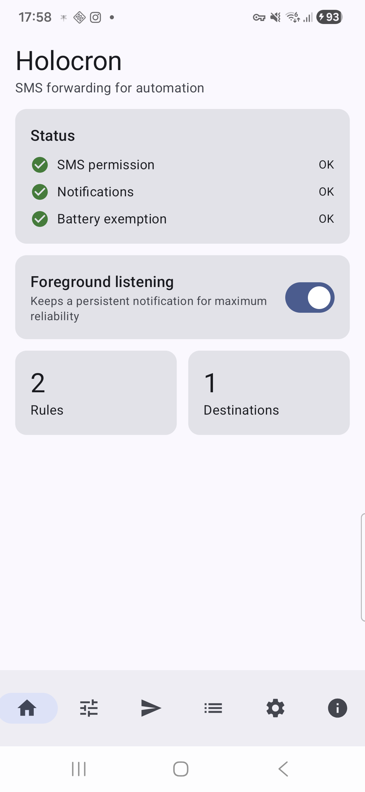
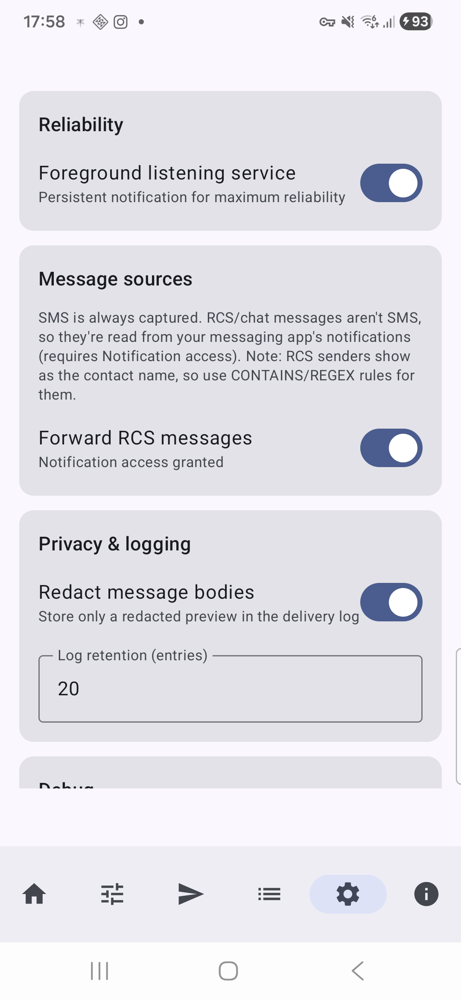
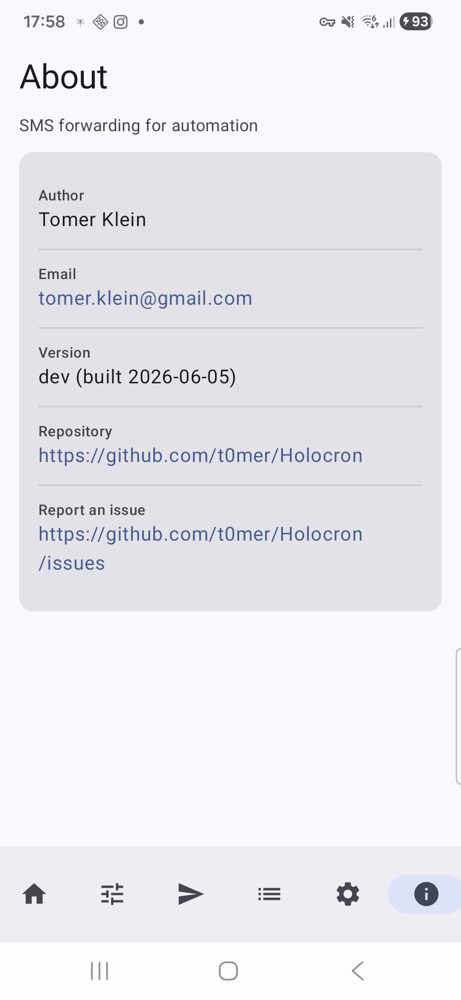
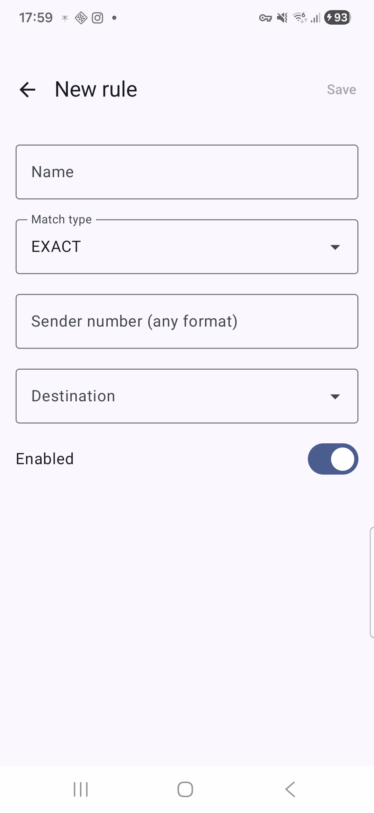
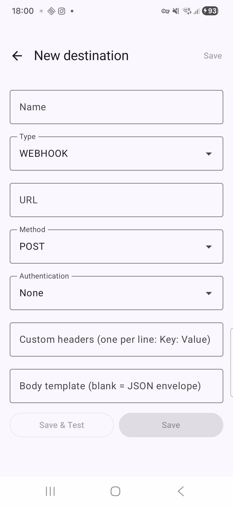
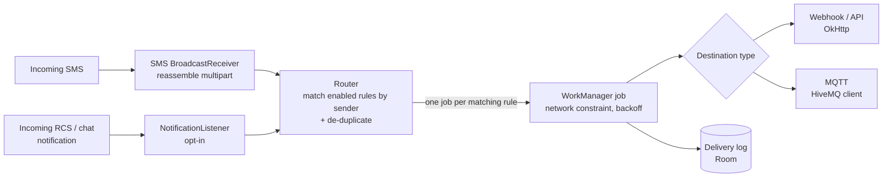

# Holocron

[](https://github.com/t0mer/Holocron/releases/latest)
[](https://github.com/t0mer/Holocron/actions/workflows/release.yml)
-3DDC84?logo=android&logoColor=white)

**SMS forwarding for automation.** Holocron is a sideloaded Android app that listens for
incoming **SMS** (and, optionally, **RCS** chat messages), matches them against simple
sender rules, and forwards the content to your own endpoints: an HTTP **webhook**, a generic
**REST API**, or an **MQTT** topic. It's built for a personal home lab: your phone, your
messages, your endpoints. No analytics or tracking SDKs, and nothing leaves the device except
what goes to the destinations you configure.

> Typical uses: pipe bank/2FA/OTP alerts into Home Assistant or n8n, push delivery and alarm
> texts to MQTT, or kick off automations from messages sent by a specific number.

## Table of contents

- [Screenshots](#screenshots)
- [Features](#features)
- [How it works](#how-it-works)
- [Requirements](#requirements)
- [Installation](#installation)
- [Getting started](#getting-started)
- [Configuration](#configuration)
  - [Rules](#rules)
  - [Destinations](#destinations)
  - [Payloads](#payloads)
  - [Settings](#settings)
- [Delivery and retries](#delivery-and-retries)
- [Permissions and privacy](#permissions-and-privacy)
- [Troubleshooting](#troubleshooting)
- [Build](#build)
- [Releases](#releases)
- [Tech stack](#tech-stack)
- [Contributing](#contributing)
- [License](#license)

## Screenshots

| Home / Status | Settings | About |
|---|---|---|
|  |  |  |

| New rule | New destination |
|---|---|
|  |  |

<!-- TODO: screenshot of the Rules list, Destinations list and Delivery log tabs -->

## Features

- **SMS capture** via a manifest broadcast receiver. Multipart messages are reassembled per
  sender. The app does **not** become the default SMS app and never requests `READ_SMS`/`SEND_SMS`.
- **RCS capture (opt-in)** via a `NotificationListenerService` that reads incoming messages
  from Google Messages and Samsung Messages. RCS never arrives as SMS, so it's read from notifications.
- **Sender rules** with three match modes:
  - `EXACT`: phone numbers normalized to E.164 (so `+972…`, `0…`, and spaced forms all match).
  - `CONTAINS` / `REGEX`: operate on the raw sender, ideal for alphanumeric sender IDs and
    RCS contacts (which surface as a display name).
- **Destinations**:
  - **Webhook / REST API** (OkHttp) with a selectable method, a body template, and custom headers.
  - **HTTP authentication**: None, Basic (user + password), Token (`Authorization: Bearer …`),
    or **Cloudflare service tokens** (`CF-Access-Client-Id` / `CF-Access-Client-Secret`).
  - **MQTT** (HiveMQ client, MQTT 3.1.1): host/port, TLS, topic, QoS, retain, optional
    credentials, and raw-body or full-JSON payload.
- **Payload templating**: `{{sender}}`, `{{body}}`, `{{timestamp}}`, `{{ruleName}}`, or the
  default JSON envelope `{sender, body, timestamp, ruleName}`.
- **Reliable delivery**: every forward runs through WorkManager with a network constraint and
  exponential-backoff retry. A **delivery log** records each attempt, with expandable error
  detail and a **Retry** action for failed deliveries.
- **Test button**: send a synthetic message to a destination to validate wiring without
  waiting for a real text.
- **Reliability options**: an optional persistent foreground service, a battery-optimization
  exemption prompt, and re-arming on reboot.
- **Backup**: export/import rules and destinations as JSON (idempotent re-import; stored
  secrets are never exported, but destination URLs are).

## How it works


```mermaid
flowchart LR
    SMS[Incoming SMS] --> BR[SMS BroadcastReceiver<br/>reassemble multipart]
    RCS[Incoming RCS / chat<br/>notification] --> NL[NotificationListener<br/>opt-in]
    BR --> R[Router<br/>match enabled rules by sender<br/>+ de-duplicate]
    NL --> R
    R -->|one job per matching rule| W[WorkManager job<br/>network constraint, backoff]
    W --> D{Destination type}
    D --> H[Webhook / API<br/>OkHttp]
    D --> M[MQTT<br/>HiveMQ client]
    W --> L[(Delivery log<br/>Room)]
```

1. The SMS receiver does no network I/O: it reassembles the message, matches it against the
   enabled rules, and enqueues one WorkManager job per matching rule.
2. The message body for each job is stored **encrypted** (keyed by the delivery-log entry), not in
   WorkManager's plaintext input data.
3. The worker sends the message to the rule's destination and records the outcome in the delivery log.

A real SMS that also raises a messaging-app notification is **de-duplicated** (same rule + same
body within 8 seconds), so it forwards only once. A message that matches two different rules is
still forwarded to each of them.

## Requirements

- An Android phone running **Android 8.0 (API 26)** or newer (the app targets Android 15, API 35).
  A SIM / telephony is needed to receive SMS; the app still installs on devices without it.
- For RCS: **Google Messages** or **Samsung Messages** as the messaging app, plus Notification access.
- At least one endpoint reachable from the phone: an HTTP(S) webhook/API (e.g. Home Assistant,
  n8n, Node-RED) or an MQTT broker. No account or cloud service is required.

## Installation

Holocron is distributed by **sideloading**. It is not published on Google Play (its SMS and
background features are restricted there).

1. Download `holocron-<version>.apk` from the
   [latest release](https://github.com/t0mer/Holocron/releases/latest).
2. Open it on the phone and allow installation from that source when Android asks.
3. Later releases are signed with the same key, so they install **in place** over the existing
   app without losing data.

> If you previously installed a build signed with a different key (for example, your own debug
> build), Android refuses the update with *App not installed*. Uninstall the old copy once, then
> install the release APK. See [`RELEASING.md`](RELEASING.md).

To build the APK yourself, see [Build](#build).

## Getting started

1. Install the app (see [Installation](#installation)).
2. Open the app and grant **SMS** and **Notifications** permissions on the Home screen; accept
   the **battery-optimization** exemption for reliable background delivery.
3. Add a **Destination** (webhook/API/MQTT) and use **Save & Test** to verify it.
4. Add a **Rule** matching a sender and pointing at that destination.
5. (Optional) In **Settings → Message sources**, enable **Forward RCS messages** and grant
   notification access.

The app has six tabs: **Home**, **Rules**, **Destinations**, **Log**, **Settings**, and **About**.

> **RCS note:** RCS senders appear as the contact's **display name** (the number when the
> messaging app provides it, or for unknown senders), not always a phone number. Use
> `CONTAINS`/`REGEX` rules for RCS contacts.

## Configuration

All configuration is done in the app. There are no config files or environment variables.

### Rules

| Field | Description |
|---|---|
| Name | Free text. Available to payloads as `{{ruleName}}`. |
| Match type | `EXACT`, `CONTAINS`, or `REGEX` (see below). |
| Sender | The number, substring, or regular expression to match against the sender. |
| Destination | Where matching messages are forwarded. |
| Enabled | Disabled rules are ignored. Also toggleable from the Rules list. |

| Match type | Behaviour |
|---|---|
| `EXACT` | Both the sender and the pattern are normalized to E.164, using the SIM's country (or, failing that, the network's country) as the default region for local-format numbers, then compared. RCS messages carry no region, so a local-format RCS sender (e.g. `050…`) won't normalize and won't match `EXACT`. Alphanumeric sender IDs typically don't match `EXACT`. |
| `CONTAINS` | Case-insensitive substring match on the raw sender (e.g. `MyBank`). |
| `REGEX` | Kotlin/Java regular expression, matched anywhere in the raw sender. An invalid regex never matches. |

### Destinations

**Webhook** and **API** are two labels for the same HTTP sender. They share these fields:

| Field | Description |
|---|---|
| URL | Full endpoint URL (`https://…` recommended). |
| Method | `POST` (default), `PUT`, `PATCH`, `DELETE`, or `GET`. The request always has a body (see [Troubleshooting](#troubleshooting) about `GET`). |
| Authentication | `None`, `Basic Auth` (username + password), `Token` (sent as `Authorization: Bearer <token>`), or `Cloudflare Service Token` (`CF-Access-Client-Id` + `CF-Access-Client-Secret`). |
| Custom headers | One per line, `Key: Value`. Authentication headers win if the same header name is used. |
| Body template | Optional. Blank sends the default JSON envelope. |

Requests are sent with `Content-Type: application/json; charset=utf-8`.

**MQTT** destinations:

| Field | Default | Description |
|---|---|---|
| Broker host | — | Hostname or IP of the broker. |
| Port | `1883` | Switches between `1883` and `8883` when you toggle TLS (unless you set a custom port). |
| Use TLS (MQTTS) | off | Uses the system trust store. The app warns when TLS is off. |
| Topic | — | Topic to publish to. |
| QoS | `1` | `0`, `1`, or `2`. |
| Retain | off | Publish with the retain flag. |
| Publish full JSON | off | On: publish the JSON envelope. Off: publish the raw message body. |
| Username / Password | — | Optional broker credentials. The password is only sent when a username is set. |

The MQTT client ID is generated once per install (`holocron-<uuid>`) and reused for every
publish. Holocron connects, publishes, and disconnects for each message.

A destination that is still used by a rule cannot be deleted; reassign or delete those rules first.

### Payloads

Without a body template (and for MQTT with **Publish full JSON** on), the payload is:

```json
{
  "sender": "+15551234567",
  "body": "Your code is 123456",
  "timestamp": 1780000000000,
  "ruleName": "Bank OTP"
}
```

`timestamp` is the message time in Unix epoch **milliseconds**.

A body template replaces these placeholders (case-sensitive) with the raw values:

| Placeholder | Value |
|---|---|
| `{{sender}}` | Sender number or name |
| `{{body}}` | Full message text |
| `{{timestamp}}` | Epoch milliseconds |
| `{{ruleName}}` | Name of the matching rule |

Example template for a JSON API:

```json
{"title": "SMS from {{sender}}", "message": "{{body}}"}
```

> Placeholder values are inserted as-is (not JSON-escaped). A message containing `"` or a
> newline can produce invalid JSON in a hand-written JSON template; use the default envelope when
> the message text is unpredictable.

The **Test** action (on the Destinations list, or **Save & Test** in the editor) sends a
synthetic message from `+10000000000` with the body `Holocron test message` and the rule name
`Test`, bypassing rules and the retry queue.

### Settings

| Section | Setting | Default | Description |
|---|---|---|---|
| Reliability | Foreground listening service | off | Keeps a persistent notification so the process stays warm; restarted after reboot when enabled. Also available on the Home screen. |
| Message sources | Forward RCS messages | off | Forwards messages read from Google/Samsung Messages notifications. Requires Notification access. |
| Privacy & logging | Redact message bodies | on | The delivery log stores `<redacted N chars>` instead of the first 120 characters of the body. |
| Privacy & logging | Log retention (entries) | `200` | Number of delivery-log entries kept (20–5000). |
| Debug | Debug logging | off | Logs every incoming message (sender and full body) to logcat, in any build type. Turn it off when you're done. |
| Backup | Export / Import | — | Saves or loads `holocron-config.json` with rules and destinations. |

Backup notes:

- Secrets (HTTP auth credentials, custom headers, MQTT credentials) are **not** exported. Re-enter
  them after an import.
- Destination URLs **are** exported as-is. If a URL contains a token or key (for example a
  webhook ID or a `?token=` query parameter), treat the export file as sensitive.
- Import is idempotent: a destination with the same name and type, or an identical rule, is
  not duplicated.

## Delivery and retries

| Outcome | Result |
|---|---|
| HTTP 2xx, or MQTT publish succeeded | **Success**. The stored body is deleted. |
| HTTP 5xx or any other non-2xx status that isn't a 4xx, timeout, network/IO error, or any MQTT connect/publish error | **Retrying** with exponential backoff (starting at 10 s), up to **5 attempts**. After the last attempt the entry is **Failed**, and the encrypted body is kept so you can retry it from the log. |
| HTTP 4xx, empty/invalid URL, or missing MQTT host/topic | **Failed** immediately, without retries. The body is deleted, so a manual retry isn't possible. |

Jobs only run when the device has a network connection. HTTP timeouts are 15 s to connect and
30 s for reads and writes.

## Permissions and privacy

| Permission | Why |
|---|---|
| `RECEIVE_SMS` | Intercept incoming SMS (runtime grant). |
| `POST_NOTIFICATIONS` | The foreground-service notification (runtime grant on Android 13+). |
| Notification access | Only if you enable RCS forwarding (granted from system settings). |
| `INTERNET`, `ACCESS_NETWORK_STATE` | Deliver to your destinations; wait for connectivity. |
| `RECEIVE_BOOT_COMPLETED` | Restart the foreground service after a reboot. |
| `FOREGROUND_SERVICE`, `FOREGROUND_SERVICE_SPECIAL_USE` | The optional always-on listening service. |
| `WAKE_LOCK` | Background delivery through WorkManager. |
| `REQUEST_IGNORE_BATTERY_OPTIMIZATIONS` | Ask for the battery-optimization exemption. |

Privacy posture:

- Credentials (MQTT, HTTP auth, custom headers) and the full in-flight message body are stored
  **encrypted** (Android Keystore–backed `EncryptedSharedPreferences`), not in the database or
  WorkManager input.
- Some message data is stored in **plaintext** on the device: the sender, in the local Room
  database and in WorkManager's job input, and, when **Redact message bodies** is turned off,
  the first 120 characters of each body in the delivery log.
- Rules, destinations (without secrets), and the delivery log (sender, time, status, preview)
  are stored in a local Room database. Cloud backup is disabled (`allowBackup="false"`); the app
  defines no data-extraction rules, so device-to-device transfer may still include app data on
  Android 12+.
- Message bodies are **never logged** unless you explicitly enable the **Debug logging**
  switch in Settings.
- The delivery log stores a redacted preview by default (toggleable).
- The only network traffic is to the destinations you configure. Prefer HTTPS and MQTT over
  TLS, since message contents (often OTP codes) are sensitive.

## Troubleshooting

- **Nothing is forwarded.** Check the Home screen: SMS permission and the battery exemption should
  show **OK**. Make sure the rule is enabled (the switch on the Rules list) and uses the right match type:
  alphanumeric senders (e.g. `MyBank`) need `CONTAINS` or `REGEX`, not `EXACT`. On aggressive
  OEM builds, enable the foreground listening service.
- **RCS messages are not forwarded.** Enable **Forward RCS messages** and grant Notification
  access. Only Google Messages and Samsung Messages are read. Messages whose notifications are
  silenced or dismissed before they post can be missed, and long messages may be truncated to
  the notification preview.
- **`GET` destinations fail with "Bad request".** Holocron always sends a request body, which
  OkHttp does not allow for `GET`. Use `POST`, `PUT`, or `PATCH`.
- **A failed delivery can't be retried** ("message body is no longer available"). Only
  deliveries that failed after exhausting their retries keep their body; permanent failures
  (4xx, bad configuration) don't.
- **Can't delete a destination.** It is still used by one or more rules.
- **Destinations stop authenticating after an import.** Secrets are not part of the backup; re-enter them.
- **"App not installed" when updating.** The installed copy was signed with a different key.
  Uninstall it once, then install the release APK (see [`RELEASING.md`](RELEASING.md)).
- **Inspect incoming messages.** Temporarily enable **Debug logging** and watch
  `adb logcat -s MsgRouter`.

## Build

Requires JDK 17 and the Android SDK (compileSdk 35). Use the Gradle wrapper.

```bash
./gradlew assembleDebug          # build the debug APK
./gradlew installDebug           # install on a connected device
./gradlew testDebugUnitTest      # unit tests
./gradlew testDebugUnitTest --tests "*.NumberMatcherTest"   # a single test class
./gradlew lint                   # lint
./gradlew assembleRelease -PholocronVersion=2026.6.0        # minified release APK
```

- The debug APK is written to `app/build/outputs/apk/debug/app-debug.apk`; the release APK to
  `app/build/outputs/apk/release/`.
- Without `-PholocronVersion` the version is `dev` (`versionCode` 1), which cannot install over a
  dated release. Pass a real `YYYY.M.PATCH` version when updating a phone that runs a release.
- Signing reads the `HOLOCRON_KEYSTORE_FILE`, `HOLOCRON_KEYSTORE_PASSWORD`, `HOLOCRON_KEY_ALIAS`,
  and `HOLOCRON_KEY_PASSWORD` environment variables first, then a git-ignored
  `keystore.properties` (`storeFile`, `storePassword`, `keyAlias`, `keyPassword`). When a key is
  present, debug builds are signed with it too; otherwise the default debug key is used. Without
  a key, `assembleRelease` produces an unsigned APK.

Project layout (`app/src/main/java/dev/tomerklein/holocron/`):

| Package | Contents |
|---|---|
| `sms/` | SMS broadcast receiver, multipart reassembly, boot receiver |
| `notifications/` | RCS notification listener |
| `ingest/` | Message router and de-duplication |
| `rules/` | Sender matching (`NumberMatcher`) |
| `dispatch/` | WorkManager worker, HTTP and MQTT dispatchers, payload templates |
| `data/` | Room entities/DAOs, settings (DataStore), encrypted secrets, backup model |
| `service/` | Optional foreground listening service |
| `ui/` | Compose screens (home, rules, destinations, log, settings, about) |

## Releases

Releases are **signed APKs** published from GitHub Actions (manual **Run workflow** on the
**Release** workflow), versioned `YYYY.M.PATCH`. Because every build uses the same signing key,
installs update **in place**. See [`RELEASING.md`](RELEASING.md) for keystore setup and the
required repository secrets.

A separate manual **Play Bundle** workflow builds a signed Android App Bundle (`.aab`) and
uploads it as a workflow artifact for the Google Play Console. It does not publish anything by itself.

## Tech stack

Kotlin · Jetpack Compose + Material 3 · Hilt · Room · WorkManager · OkHttp · HiveMQ MQTT client ·
libphonenumber · kotlinx.serialization · DataStore · `androidx.security` (EncryptedSharedPreferences).
`minSdk 26`, `targetSdk 35`, single-activity MVVM.

## Contributing

Issues and pull requests are welcome at
[github.com/t0mer/Holocron](https://github.com/t0mer/Holocron/issues). Please run
`./gradlew testDebugUnitTest lint` before opening a PR, and never commit signing material
(`*.jks`, `keystore.properties`).

## License

This repository does not currently include a license file.
